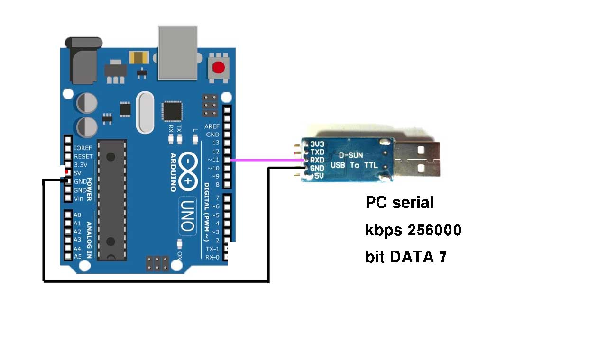

# Extra Serial port for a microcontroller using SPI

In this project, you can use one of the SPI ports in any board as a UART transmitter port.
This project can be implemented on any microcontroller and processor.

## features

* Add low-cost TX UART for your system if you don't have extra UART pin
	* It is the lowest cost extra log(Just TX) serial you can find on any microcontroller and board
	* If you have low rate data you can use software serial instead
* It is high rate UART that can send data with a rate of 1.5Mb or higher (In Arduino I tested for 256000)

## Limitation

Arduino has a simple serial port and it is hard to work with that but it can work on the other board, I'm planning to test it on Raspberry PI and STM32 Boards.
* Now board works with just 7 bit in serial, it is not bad for sending the text.
* you have a baud rate mismatch with serial. in our case with Arduino, the board send with 25000kb while PC read data with 256000bps
I have not a problem with features.
* In my implementation the serial baud rate decrease because I send 2 bytes for 1 byte in real serial, but the algorithm can handle it to maximize throughput.

## Method

In this code, we convert a byte to send to a new packet for serial. this method only works for Tx, For RX a very complex method should be implemented.

UART byte => |b0 b1 b2 b3 b4 b5 b6 b7| (b mean bit) 

we convert these bytes to 

SPI byte 1 => 

| 0 b0 b1 b2 b3 b4 b5 b6| ( the first '0' is act as start bit)

SPI byte 2 => 

| b7 1  1  1  1  1  1   1| ( the '1' is act as stop bit)

## Test





I test the code with PL2303 USB TTL chip
Output sample with baud rate **256000** and **7 bit** data(Now the code has a problem with 8 bit but with 7 bits works well with the text.


### Result PC Terminal

```

*Test Send data with spi to Computer serial!abcdefghijklmnopqrstuvw ABCDEFGHIJKLMNOPQRSTUVW <\n> <\r><\0><\0><\0><\0><\0>H
*Test Send data with spi to Computer serial!abcdefghijklmnopqrstuvw ABCDEFGHIJKLMNOPQRSTUVW <\n> <\r><\0><\0><\0><\0><\0>H
*Test Send data with spi to Computer serial!abcdefghijklmnopqrstuvw ABCDEFGHIJKLMNOPQRSTUVW <\n> <\r><\0><\0><\0><\0><\0>H
*Test Send data with spi to Computer serial!abcdefghijklmnopqrstuvw ABCDEFGHIJKLMNOPQRSTUVW <\n> <\r><\0><\0><\0><\0><\0>H
*Test Send data with spi to Computer serial!abcdefghijklmnopqrstuvw ABCDEFGHIJKLMNOPQRSTUVW <\n> <\r><\0><\0><\0><\0><\0>H

```


## TODO

* It is an initial version, the file should convert to a library and then some extra pin in Arduino such SPI CLK should be deactivated during working.
* implement on Raspberry PI and another microcontroller
* problem with 8 bit DATA should be checked with a logic analyzer